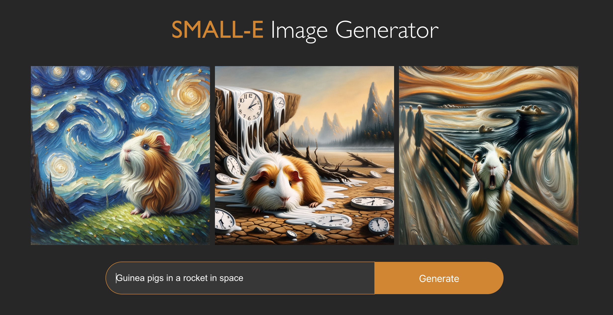

# SMALL-E Image Generator

## Description

The SMALL-E AI Image Generator is a small web application that uses OPENAI API to generate images based on a user's input. The application will then generate the images and display them to the user. The user can then download the images to their local machine.



### Clone the project

Clone the project to your local machine

```bash
git clone [https://#]
```

### Get API Key

Go to openai.com and create an account. Once you have created an account, go to your profile and select "View API Keys" in the dropdown menu. Now press "Create new secret key" and give it a name. Copy the key and paste it in the ImageGenerator.jsx file in the headers.
